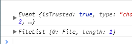
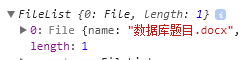

#### File文件
> （File）对象获取文件的信息。实际上，File 对象是特殊类型的 Blob，Blob 的属性和方法都可以用于 File 对象。在js中，一般通过input元素，点击上传文件成功之后返回的File对象；
######  在input标签中定义一个file类型的input
```
<input type="file" ref="upload" accept=".docx,.pdf">
```
- type: 当前的输入类型文件
- ref: 相当于当前input的唯一标识
- accept：指定上传文件的格式 word或者pdf
###### 绑定监听表格导入事件
```
mounted(){
	this.$refs.upload.addEventListener('change', e => {
		this.readExcel(e);
	})
}
methods: {
    readExcel(e) {
	console.log(e)
	const file = e.target.files;
	console.log(file)
    },
}
```
###### 打印结果file为 FileList 数组，这个数组的每个元素都是一个 File 对象，一个上传的文件就对应一个 File 对象：


> file的属性：length，返回file所包含的文件个数。可以为多个因为是个FileList 数组
> file的方法：item()方法也可以使用file的下标来表示：file.item(0) 也可以写成 file[0]
#### FileReader
> FileReader 是一个异步 API，用于读取文件并提取其内容以供进一步使用。FileReader 可以将 Blob 读取为不同的格式。FileReader类可以读取到file类实例所指代的文件的内容。要想获得用户所选文件的base64地址必须使用FileReader类。
###### 创建filereader类的实例：
`const fileFr = new FileReader();`
###### 常用属性：
```
error：表示在读取文件时发生的错误；
result：文件内容。该属性仅在读取操作完成后才有效，数据的格式取决于使用哪个方法来启动读取操作。
```
###### FileReader 对象的常用方法：
```
readAsArrayBuffer() 读取file文件的内容，并作为arraybuffer格式得到结果。
readAsDataURL() 读取file文件并返回file文件的base64地址。
readAsBinaryString() 以二进制字符串的形式读取文件。
readAsText() 按照指定的charset字符集以文本文件的形式读取file文件的内容。
```
```
//----表格导入方法
    readExcel(e) {
      const file = e.target.files;
      const fr = new FileReader();
      fr.readAsArrayBuffer(file[0])
      fr.onload = (e) => {
        // 文件的ArrayBuffer结果
        const buffer = Buffer.from(e.target.result)
      }
    },
```
###### FileReader 对象常用的事件：
```
abort：该事件在读取操作被中断时触发；
error：该事件在读取操作发生错误时触发；
load：该事件在读取操作完成时触发；
progress：该事件在读取 Blob 时触发。
loadstart：开始读取文件时触发。
progress：读取文件过程中触发。
```
#### Base64
> Base64 是一种基于64个可打印字符来表示二进制数据的表示方法。可以将图片转成base64，可以减少 HTTP 请求也可以将字符串进行解码和编码。

###### 解码和编码 base64 字符串：
```
atob()：解码，解码一个 Base64 字符串；
btoa()：编码，从一个字符串或者二进制数据编码一个 Base64 字符串。
```
#### 不同格式之间的转换:
###### 1.File对象转Base64：
```
const file = e.target.files;
const fr = new FileReader();
fr.readAsDataURL(file[0])
fr.onload = (e) => {
	console.log(e.target.result)
}
```
###### 2.ArrayBuffer转blob
```
const blob = new Blob([new Uint8Array(buffer, byteOffset, length)]);
```
###### 3.ArrayBuffer转base64
```
const base64 = btoa(String.fromCharCode.apply(null, new Uint8Array(arrayBuffer)));
```
###### 4.base64转blob
```
const base64toBlob = (base64Data, contentType, sliceSize) => {
  const byteCharacters = atob(base64Data);
  const byteArrays = [];

  for (let offset = 0; offset < byteCharacters.length; offset += sliceSize) {
    const slice = byteCharacters.slice(offset, offset + sliceSize);

    const byteNumbers = new Array(slice.length);
    for (let i = 0; i < slice.length; i++) {
      byteNumbers[i] = slice.charCodeAt(i);
    }

    const byteArray = new Uint8Array(byteNumbers);
    byteArrays.push(byteArray);
  }

  const blob = new Blob(byteArrays, {type: contentType});
  return blob;
}
```
###### 5.blob转ArrayBuffer
```
function blobToArrayBuffer(blob) { 
  return new Promise((resolve, reject) => {
      const reader = new FileReader();
      reader.onload = () => resolve(reader.result);
      reader.onerror = () => reject;
      reader.readAsArrayBuffer(blob);
  });
}
```
###### 6.blob转base64
```
function blobToBase64(blob) {
  return new Promise((resolve) => {
    const reader = new FileReader();
    reader.onloadend = () => resolve(reader.result);
    reader.readAsDataURL(blob);
  });
}
```
###### 7.blob转Object URL
```
const objectUrl = URL.createObjectURL(blob);
```
###### 8.blob转成text文本
```
async() => {
	return await (new Response(blob).text())
}
```
###### 9.Buffer转JSON
```
let bufferDatas = Buffer.from('woshibufferwenjian')
console.log(bufferDatas)
let json = JSON.stringify(bufferDatas, null, 2)
console.log(json)
```
###### 10.JSON转Buffer
```
let bufferFile = Buffer.from(JSON.parse(json).data)
console.log(bufferFile)
```
###### 11.Buffer转UTF-8字符串
```
bufferFile.toString('utf8')
```
  
