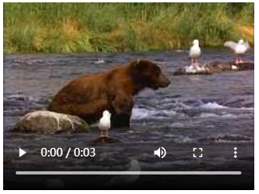
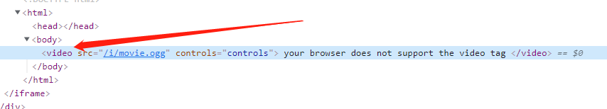
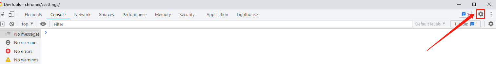
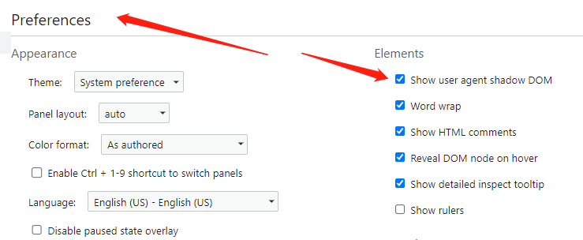
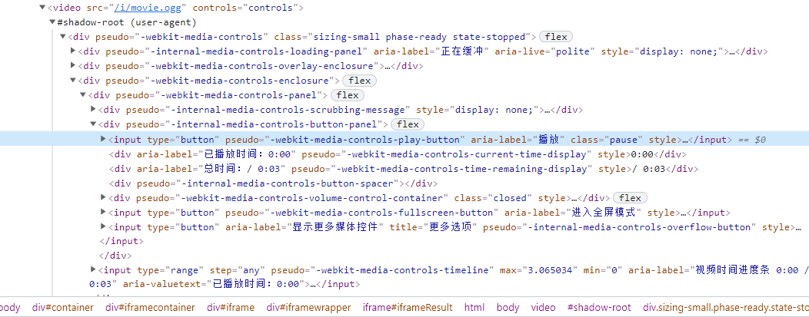
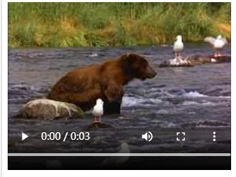

#### 需求：
> ##### 1.播放器可以支持上传默认封面图片
> ##### 2.播放器的进度条长度拉长些,与播放器长度一样长，或者其他方式美化一下
首先需求` 1.播放器可以支持上传默认封面图片`解决方案：
###### 1.第一种方法可以直接在video标签中直接添加poster属性
```
<!DOCTYPE HTML>
<html>
<body>

<video src="/i/movie.ogg" controls="controls" poster="../../imgs/poster.png">
your browser does not support the video tag
</video>

</body>
</html>

```
###### 2.前端利用js给video标签追加poster属性以及属性对应的图片路径：
```
<!DOCTYPE HTML>
<html>
<body>

<video src="/i/movie.ogg" controls="controls" id="myVideo">
your browser does not support the video tag
</video>

</body>
</html>
<script type="text/javascript">
	const thisVideo = document.getElementById('myVideo');
	const thisVideoImgSrc = "img/poster.png"
	thisVideo.setAttribute('poster',thisVideoImgSrc)
</script>
```
###### 下图为正常video标签的显示图片（客户说不好看要求对video播放器样式进行美化）

###### 就以`2.播放器的进度条长度拉长些,与播放器长度一样长`为例进行样式的修改
#### 操作步骤：
###### 1.首先需要利用浏览器内部设置进行对video标签的内部构造进行查看，正常状态下浏览器F12抓取到video播放器如下图，我们无法看到video内部构造，所以无法对video播放器样式进行修改

###### 2.谷歌浏览器下，找到F12开发者工具->设置按钮->Preferences->Show user agent 勾选shadow DOM


###### 3.然后右键选中video播放器->检察,将会看到一下内容，可以看到video的内部结构，这样就可以根据类名进行样式的修改

###### 4.修改video播放器的进度条长度问题代码：
```
video::-webkit-media-controls-timeline {
  padding-left: 0px!important;
  padding-right: 0px!important;
}
```
###### 修改完之后样式如下（本子自己感觉还是有一点距离好看，很无奈！）

