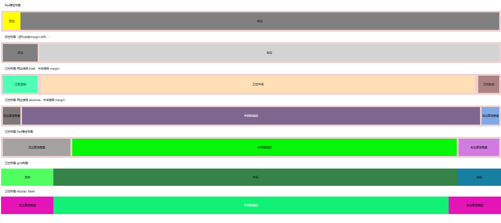

> 在前端日常布局中，会经常遇到左侧宽度固定，右侧自适应或者左右两边固定，中间部分自适应的实用场景。本文例子中将列举出两种常用的两栏布局，左侧固定右侧自适应的常用方法以及代码和五种左右固定中间自适应的常用方法以及代码
<!-- more -->
*具体实现效果展示如下：*

#### 1.二栏布局-flex弹性布局
```
<!-- flex弹性布局 -->
  <div class="title">flex弹性布局：</div>
  <div class="box1">
    <div class="left1">左边</div>
    <div class="right1">右边</div>
  </div>
```
```
// flex弹性布局
.box1 {
  display: flex;
  height: 100px;
  background: rgb(241, 210, 210);
  padding: 10px;

  .left1 {
    width: 100px;
    height: 100%;
    background: yellow;
    text-align: center;
    line-height: 100px;
  }

  .right1 {
    flex: 1;
    background: grey;
    text-align: center;
    line-height: 100px;
  }
}
```
#### 2.二栏布局-左float右margin-left
```
<!-- 左float右margin-left -->
  <div class="title">双栏布局（左float右margin-left）：</div>
  <div class="box">
    <div class="left">左边</div>
    <div class="right">右边</div>
  </div>
```
```
// 双栏布局（左float右margin-left）
.box {
  overflow: hidden;
  background: rgb(241, 210, 210);
  padding: 10px;

  .left {
    float: left;
    width: 200px;
    background-color: gray;
    height: 100px;
    text-align: center;
    line-height: 100px;
  }

  .right {
    margin-left: 210px;
    background-color: lightgray;
    height: 100px;
    text-align: center;
    line-height: 100px;
  }
}
```
#### 3.三栏布局-两边使用 float，中间使用 margin
```
<!-- 三栏布局-两边使用 float，中间使用 margin -->
  <div class="title">三栏布局-两边使用 float，中间使用 margin：</div>
  <div class="box-float-margin">
    <div class="left">三栏左侧</div>
    <div class="right">三栏右侧</div>
    <div class="center">三栏中间</div>
  </div>
```
```
// 三栏布局-两边使用 float，中间使用 margin
.box-float-margin {
  background: rgb(241, 210, 210);
  overflow: hidden;
  padding: 10px;
  height: 100px;

  .left {
    width: 200px;
    height: 100px;
    float: left;
    background: rgb(80, 255, 182);
    text-align: center;
    line-height: 100px;
  }

  .right {
    width: 120px;
    height: 100px;
    float: right;
    background: rgb(173, 130, 130);
    text-align: center;
    line-height: 100px;
  }

  .center {
    margin-left: 220px;
    height: 100px;
    background: rgb(255, 223, 182);
    margin-right: 140px;
    text-align: center;
    line-height: 100px;
  }
}
```
#### 4.三栏布局-两边使用 absolute，中间使用 margin
```
  <!-- 三栏布局-两边使用 absolute，中间使用 margin  -->
  <div class="title">三栏布局-两边使用 absolute，中间使用 margin:</div>
  <div class="box-absolute">
    <div class="left">左边固定宽度</div>
    <div class="right">右边固定宽度</div>
    <div class="center">中间自适应</div>
  </div>
```
```
// 三栏布局-两边使用 absolute，中间使用 margin
.box-absolute {
  position: relative;
  background: rgb(241, 210, 210);
  padding: 10px;

  div {
    height: 100px;
    text-align: center;
    line-height: 100px;
  }

  .left {
    position: absolute;
    top: 10px;
    left: 10px;
    width: 100px;
    background: rgb(128, 119, 119);
  }

  .right {
    position: absolute;
    top: 10px;
    right: 10px;
    width: 100px;
    background: rgb(128, 168, 228);
  }

  .center {
    margin: 0 110px;
    background: rgb(126, 102, 143);
    color: rgb(255, 255, 255);
  }
}
```
#### 5.三栏布局-flex弹性布局
```
  <!-- 三栏布局-flex弹性布局 -->
  <div class="title">三栏布局-flex弹性布局:</div>
  <div class="box-flex-three">
    <div class="left">左边固定宽度</div>
    <div class="center">中间自适应</div>
    <div class="right">右边固定宽度</div>
  </div>
```
```
// 三栏布局-flex弹性布局
.box-flex-three {
  display: flex;
  justify-content: space-between;
  background: rgb(241, 210, 210);
  padding: 10px;

  div {
    text-align: center;
    line-height: 100px;
    height: 100px;
  }

  .left {
    width: 500px;
    background: rgb(165, 163, 162);
  }

  .right {
    width: 300px;
    background: rgb(209, 123, 226);
  }

  .center {
    background: rgb(7, 245, 7);
    width: 100%;
    margin: 0 10px;
  }
}
```
#### 6.三栏布局-grid布局
```
<!-- 三栏布局-grid布局 -->
  <div class="title">三栏布局-grid布局:</div>
  <div class="box-grid">
    <div class="left">左侧</div>
    <div class="center">中间</div>
    <div class="right">右侧</div>
  </div>
```
```
// 三栏布局-grid布局
.box-grid {
  display: grid;
  width: 100%;
  grid-template-columns: 300px auto 250px;

  div {
    text-align: center;
    line-height: 100px;
    height: 100px;
  }

  .left {
    background: rgb(80, 255, 95);
  }

  .right {
    width: 250px;
    background: rgb(23, 127, 161);
  }

  .center {
    background: rgb(54, 131, 73);
  }
}
```
#### 7.三栏布局-display: table
```
<!-- 三栏布局-display: table -->
  <div class="title">三栏布局-display: table:</div>
  <div class="box-table">
    <div class="left">左边固定宽度</div>
    <div class="center">中间自适应</div>
    <div class="right">右边固定宽度</div>
  </div>
```
```
// display: table
.box-table {
  height: 100px;
  line-height: 100px;
  text-align: center;
  display: table;
  table-layout: fixed;
  width: 100%;

  .left,
  .right {
    width: 300px;
    background: rgb(228, 20, 183);
    display: table-cell;
  }

  .center {
    background: rgb(18, 240, 118);
    color: white;
    width: 100%;
    display: table-cell;
  }
}
```
