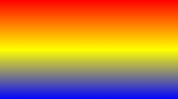

#### 实例：实现预期效果

###### 代码实现：
```
<head>
<meta charset="utf-8"> 
<title>渐变文字</title> 
<style>
#grad1 {
    margin: auto;
    font-family: SourceHanSansCN-Bold;
    font-size: 48px;
    font-weight: normal;
    font-style: italic;
    font-stretch: normal;
    line-height: 38px;
    letter-spacing: 0px;
    color: #FFFFFF;
    background-image: -webkit-linear-gradient(bottom,blue,white);
    -webkit-background-clip: text;
    -webkit-text-fill-color: transparent;
    line-height: 50px;
    font-weight: 600;
}
</style>
</head>
<body>
<div id="grad1">渐变文字</div>
</body>
```
#### CSS linear-gradient() 函数
##### 定义与用法
###### linear-gradient() 函数用于创建一个表示两种或多种颜色线性渐变的图片。创建一个线性渐变，需要指定两种颜色，还可以实现不同方向（指定为一个角度）的渐变效果。（如果不指定方向，默认从上到下渐变。）
###### 注意： Internet Explorer 9 及更早版本 IE 浏览器不支持渐变。
##### 基本用法：
```background-image: linear-gradient(red, yellow, blue);```

```
/* 从上到下，蓝色渐变到红色 */
linear-gradient(blue, red);
 
/* 渐变轴为45度，从蓝色渐变到红色 */
linear-gradient(45deg, blue, red);
 
/* 从右下到左上、从蓝色渐变到红色 */
linear-gradient(to left top, blue, red);
 
/* 从下到上，从蓝色开始渐变、到高度40%位置是绿色渐变开始、最后以红色结束 */
linear-gradient(0deg, blue, green 40%, red);
```
##### 基本语法：
```
background-image: linear-gradient(direction, color-stop1, color-stop2, ...);
```
| 值	  | 用途  |
| ------------ | ------------ |
| direction  | 用角度值指定渐变的方向（或角度）。  | 
| color-stop1, color-stop2,...	  | 用于指定渐变的起止颜色。  |

------------


| 值	  | 举例  |
| ------------ | ------------ |
| direction  | to right（从左到右）、 to bottom right（从左上角到右下角）、180deg、0deg... | 
| color-stop1, color-stop2,...	  | orange、yellow、green、blue...  |
