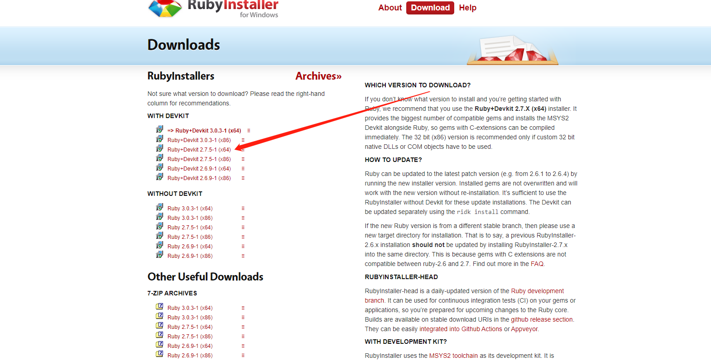

### Sass介绍：
> Sass 是一个 CSS 预处理器。是 CSS 扩展语言，可以帮助我们减少 CSS 重复的代码，节省开发时间并且完全兼容所有版本的 CSS。
> Sass 扩展了 CSS3，增加了规则、变量、混入、选择器、继承、内置函数等等特性。生成良好格式化的 CSS 代码，易于组织和维护。文件后缀为 .scss
### 为什么使用Scss？
> CSS 本身语法不够强大，导致重复编写一些代码，无法实现复用，而且在代码也不方便维护。Sass 引入合理的样式复用机制，增加了规则、变量、混入、选择器、继承、内置函数等等特性。
### 安装与使用
###### 1.使用Sass首先需要安装Ruby然后再安装Sass。Windows平台安装Ruby，官网下载地址[https://rubyinstaller.org/downloads/](https://rubyinstaller.org/downloads/ "https://rubyinstaller.org/downloads/")

###### 去官网下载安装包，下载之后安装，Ruby安装过程较为简单，选好安装位置直接下一步，默认选中安装就可以

###### 2.安装完成之后去电脑里搜索以下内容打开

###### 3.在命令行中输入命令`gem install sass`安装sass，如果安装成功输入sass -v检察是否安装成功

### 基本用法
###### 1.变量
```
// 声明
$white:#FFFFFF;
$black:#000000;
//使用
div {
	width:100px;
	height:100px;
	background-color: $white;
	color:$black;
}

```
###### 2.如果变量需要镶嵌在字符串之中，就必须需要写在#{}之中。
```
$left : left;
.sides {
　margin-#{$left}: 5px;
}
```
###### 3.样式嵌套(Sass允许选择器嵌套写法，先看一段常规CSS代码：)
```
.fd-foot2 {
  height: 190px;
  width: 100%;
  min-width: 1300px;
  background: url("../img/foot.png") no-repeat;
  background-size: 100% 100%;
}

.fd-foot2 .fd-foot2-main {
  width: 1200px;
  margin: 0 auto;
  padding-top: 36px;
}

.fd-foot2 .fd-foot2-main p {
  font-size: 16px;
  color: #FFFFFF;
  line-height: 135px;
}
```
###### 如果用sass写，可以写成一下代码：
```
// 底部footer
.fd-foot2 {
	height: 190px;
	width: 100%;
	min-width: 1300px;
	background: url('../img/foot.png') no-repeat;
	background-size: 100% 100%;
  .fd-foot2-main {
    width: 1200px;
    margin: 0 auto;
    padding-top: 36px;
    p {
      font-size: 16px;
      color: $white;
      line-height: 135px;
    }
  }
}
```
###### 在嵌套的代码块内，可以使用&引用父元素。比如a:hover伪类，可以写成：
```
a {
　 &:hover { color: #ffb3ff; }
}
```
###### 4.具有计算功能
```
.examples {
	position:absolute;
	left: (50px/2);
　　top: 50px + 100px;
　　right: $var * 10%;
}
```
###### 5.继承（代码的重用）
```
.fd-hqqd-left-bottom1-2 {
  width:100px;
  height:100px;
  margin-right: 10px;
}
.fd-hqqd-left-bottom1-1 {
  @extend .fd-hqqd-left-bottom1-2;
  margin-bottom: 10px;
}
```
###### 6.Mixin可以重用代码块，使用mixin命令定义一个代码块
```
@mixin widthHeight($widthValue:100px,$heightValue:100px) {
  width: $widthValue;
	height: $heightValue;
}
```
###### 使用@include命令，掉用这个mixin
```
.fd-hqqd-left-bottom1-2 {
  @include widthHeight(235px,172.6px);
  margin-right: 10px;
}
```
###### 7.条件语句可以使用@if @else来进行判断
```
@mixin positionAbsolute($top:null,$right:null,$bottom:null,$left:null) {
  position: absolute;
  @if ($left!="" & & $left!=null) {
    left: $left;
  }
  @if ($right!="" & & $right!=null) {
    right: $right;
  }
  @if ($top!="" & & $top!=null) {
    top: $top;
  }
  @if ($bottom!="" & & $bottom!=null) {
    bottom: $bottom;
  }
}
```
###### 8.循环语句
```
1.for
@for $i from 1 to 10 {
　　　　.border-#{$i} {
　　　　　　border: #{$i}px solid blue;
　　　　}
　　}
  2.while
 $i: 6;

　　@while $i > 0 {
　　　　.item-#{$i} { width: 2em * $i; }
　　　　$i: $i - 2;
　　}
  3.each
 @each $member in a, b, c, d {
　　　　.#{$member} {
　　　　　　background-image: url("/image/#{$member}.jpg");
　　　　}
　　}
```
###### 9.sass文件的插入，可以使用@import命令来插入外部文件
`@import './mixin.scss';`
### 静态界面中使用scss（vscode插件推荐）

###### 安装好两个插件之后，修改scss文件之前点击一下Watch Sass

###### 在scss文件里点击保存的时候，就会自动生成css文件
